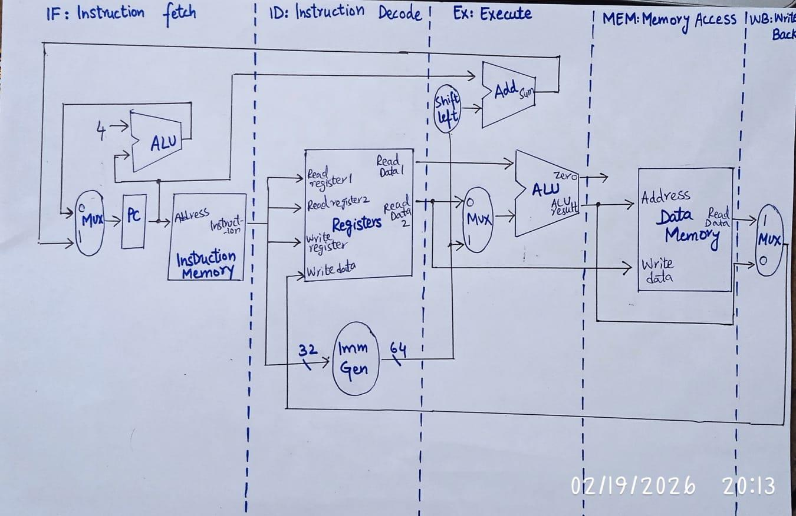
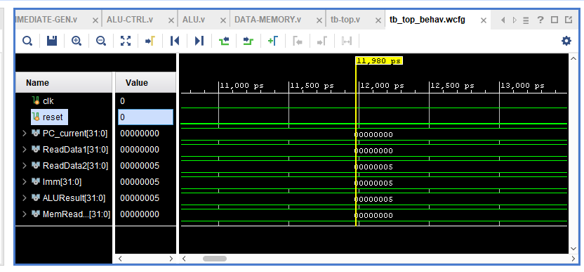
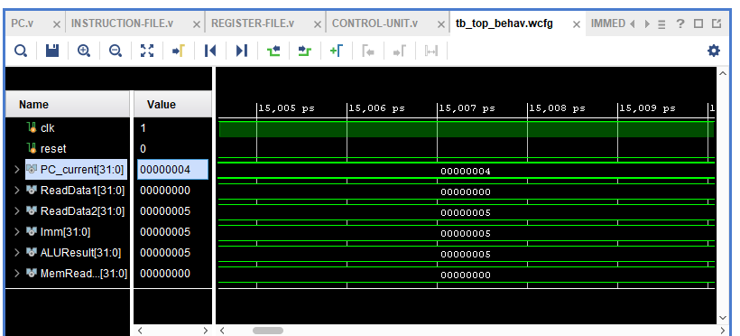
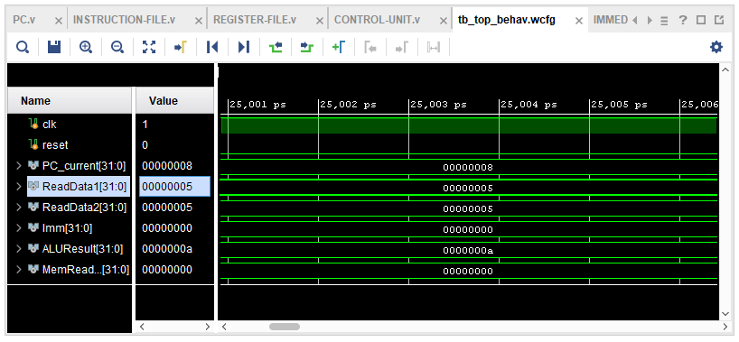
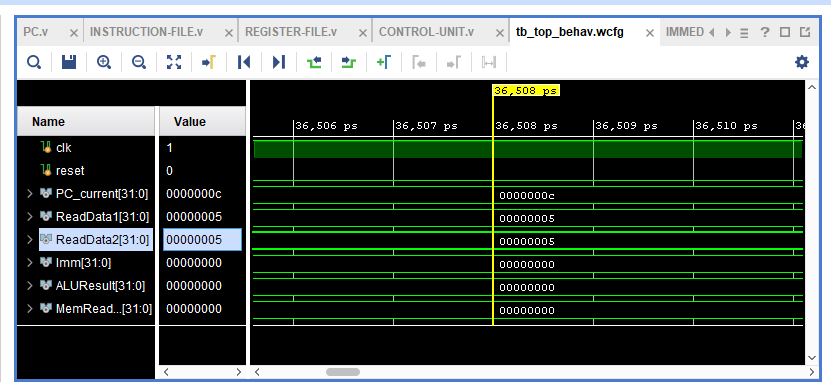
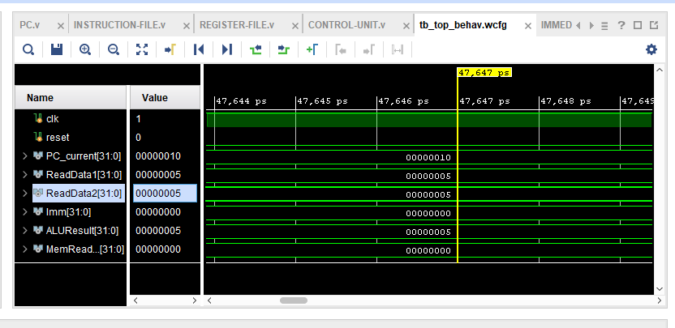
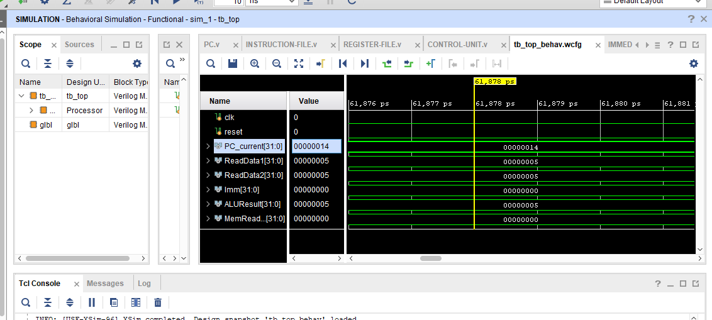
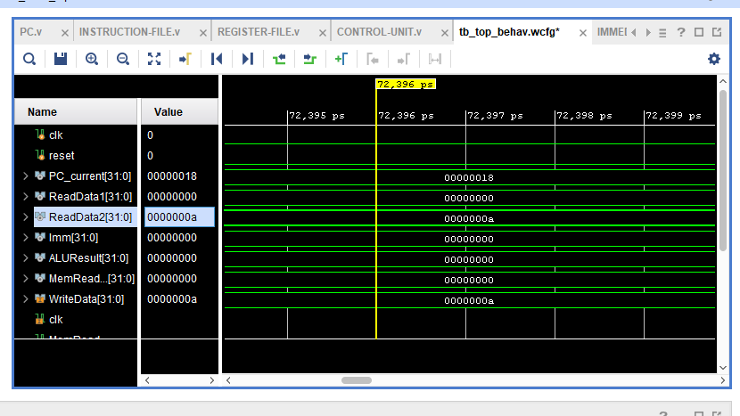
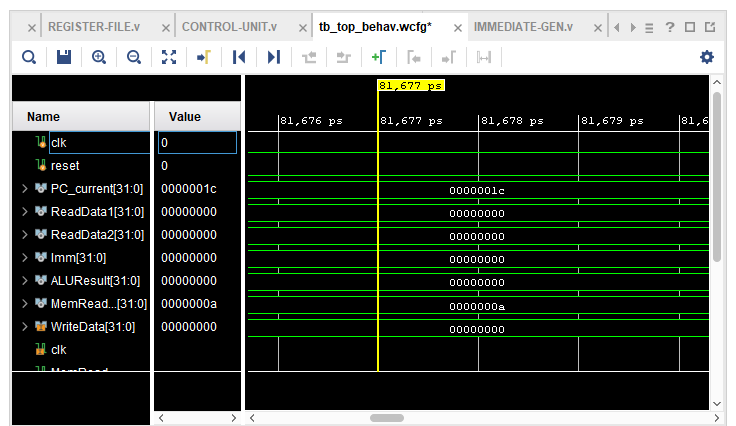
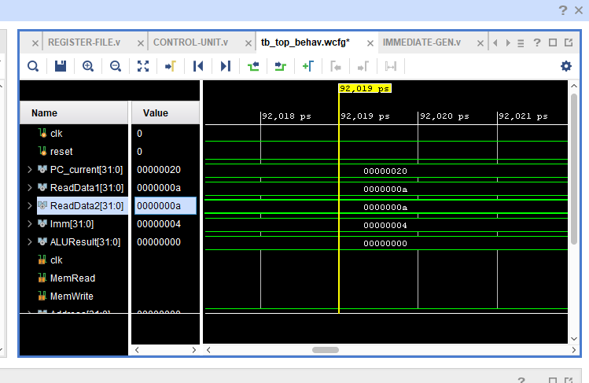

# Single-Cycle 32-bit RISC-V Processor (Verilog HDL)

A single-cycle 32-bit RISC-V processor implementing a subset of the RV32I instruction set, designed and verified in Verilog HDL using Xilinx Vivado.

## Overview

This project implements a simplified single-cycle 32-bit RISC-V processor core. Each instruction is fetched, decoded, and executed within a single clock cycle. The design follows a fully modular architecture — every functional unit (ALU, Control Unit, Register File, Immediate Generator, Instruction Memory, Data Memory) is implemented as an independent Verilog module and integrated at the top level to form a complete 32-bit datapath.

**Tools used:** Xilinx Vivado (simulation + synthesis), Verilog HDL, XSim

## Supported Instruction Set (RV32I subset)

| Type | Instructions |
|---|---|
| R-Type | ADD, SUB, AND, OR |
| I-Type | ADDI, ANDI |
| Load/Store | LW, SW |
| Branch | BEQ |

## Architecture

The processor follows the classic single-cycle RISC-V datapath: Program Counter → Instruction Memory → Register File / Immediate Generator → ALU → Data Memory → Write-back, all coordinated by a central Control Unit and a separate ALU Control unit.



**Execution flow (completed in one clock cycle):**
- **Fetch** — PC provides address to Instruction Memory, instruction is retrieved, PC+4 computed
- **Decode** — Control Unit and Immediate Generator parse the opcode, registers, and sign-extend immediates
- **Execute** — ALU performs the operation selected via ALU Control
- **Memory** — Data Memory is accessed for LW/SW
- **Write-back** — Result written to Register File when required

**Branch logic:**
```
PC_next = (Branch & Zero) ? (PC_current + Immediate) : (PC_current + 4)
```

## Module Breakdown

| Module | File | Description |
|---|---|---|
| Program Counter | [`rtl/PC.v`](rtl/PC.v) | Sequential PC update on clock edge, synchronous reset |
| Instruction Memory | [`rtl/INSTRUCTION-FILE.v`](rtl/INSTRUCTION-FILE.v) | 256-word ROM, word-aligned instruction fetch |
| Register File | [`rtl/REGISTER-FILE.v`](rtl/REGISTER-FILE.v) | 32 x 32-bit registers, combinational read, synchronous write |
| Immediate Generator | [`rtl/IMMEDIATE-GEN.v`](rtl/IMMEDIATE-GEN.v) | Sign-extends and formats immediates for I/S/B instruction types |
| Control Unit | [`rtl/CONTROL-UNIT.v`](rtl/CONTROL-UNIT.v) | Decodes opcode into datapath control signals |
| ALU Control | [`rtl/ALU-CTRL.v`](rtl/ALU-CTRL.v) | Refines ALU operation using ALUOp + funct3 + funct7 |
| ALU | [`rtl/ALU.v`](rtl/ALU.v) | Performs ADD/SUB/AND/OR, generates Zero flag for branch comparison |
| Data Memory | [`rtl/DATA-MEMORY.v`](rtl/DATA-MEMORY.v) | 256-word data memory, word-aligned read/write |
| Top-Level Processor | [`rtl/TOP-LEVEL.v`](rtl/TOP-LEVEL.v) | Integrates all modules into the complete datapath |

## Control Signal Mapping

| Instruction | Opcode | ALUSrc | RegWrite | MemRead | MemWrite | Branch | ALUOp |
|---|---|---|---|---|---|---|---|
| R-Type | 0110011 | 0 | 1 | 0 | 0 | 0 | 010 |
| I-Type | 0010011 | 1 | 1 | 0 | 0 | 0 | 011 |
| LW | 0000011 | 1 | 1 | 1 | 0 | 0 | 000 |
| SW | 0100011 | 1 | 0 | 0 | 1 | 0 | 000 |
| BEQ | 1100011 | 0 | 0 | 0 | 0 | 1 | 001 |

## Verification

The design was verified in Xilinx Vivado's XSim simulator using a self-checking testbench ([`testbench/tb-top.v`](testbench/tb-top.v)) that applies a reset and runs a 9-instruction test program for 300 simulation time units.

**Test program executed:**
```
1. addi x1, x0, 5      →  x1 = 5
2. addi x2, x0, 5      →  x2 = 5
3. add  x3, x1, x2     →  x3 = 10
4. sub  x8, x2, x1     →  x8 = 0
5. and  x6, x1, x2     →  x6 = 5
6. or   x7, x1, x2     →  x7 = 5
7. sw   x3, 0(x0)      →  Memory[0] = 10
8. lw   x4, 0(x0)      →  x4 = 10
9. beq  x4, x3, +4     →  x4 == x3 → branch taken
```

Every instruction's execution was verified instruction-by-instruction against the expected register/memory state. Waveform captures for each instruction:

**1. ADDI x1, x0, 5**


**2. ADDI x2, x0, 5**


**3. ADD x3, x1, x2**


**4. SUB x8, x2, x1**


**5. AND x6, x1, x2**


**6. OR x7, x1, x2**


**7. SW x3, 0(x0)**


**8. LW x4, 0(x0)**


**9. BEQ x4, x3, +4**


## Repository Structure

```
.
├── rtl/                    # All Verilog design modules
│   ├── PC.v
│   ├── INSTRUCTION-FILE.v
│   ├── REGISTER-FILE.v
│   ├── IMMEDIATE-GEN.v
│   ├── CONTROL-UNIT.v
│   ├── ALU-CTRL.v
│   ├── ALU.v
│   ├── DATA-MEMORY.v
│   └── TOP-LEVEL.v
├── testbench/
│   └── tb-top.v            # Self-checking testbench
├── waveforms/               # Simulation waveform screenshots (XSim)
├── docs/
│   └── block_diagram.png   # High-level architecture diagram
└── README.md
```

## Design Decisions

- 32-bit datapath, single-cycle execution model
- Separate instruction memory and data memory (Harvard-style)
- Combinational control logic, with ALU Control decoupled from the Main Control Unit
- Word-aligned memory addressing
- Branch resolution using a Zero flag from the ALU

## Possible Extensions

- Expand instruction support to full RV32I (JAL, JALR, LUI, AUIPC, remaining branch types)
- Convert to a pipelined (5-stage) implementation with hazard detection
- Add FPGA implementation/synthesis with resource utilization and timing closure reports
- Add exception handling and CSR support

---
*Developed as part of a Digital System Design course project. Simulated and verified in Xilinx Vivado (XSim).*
